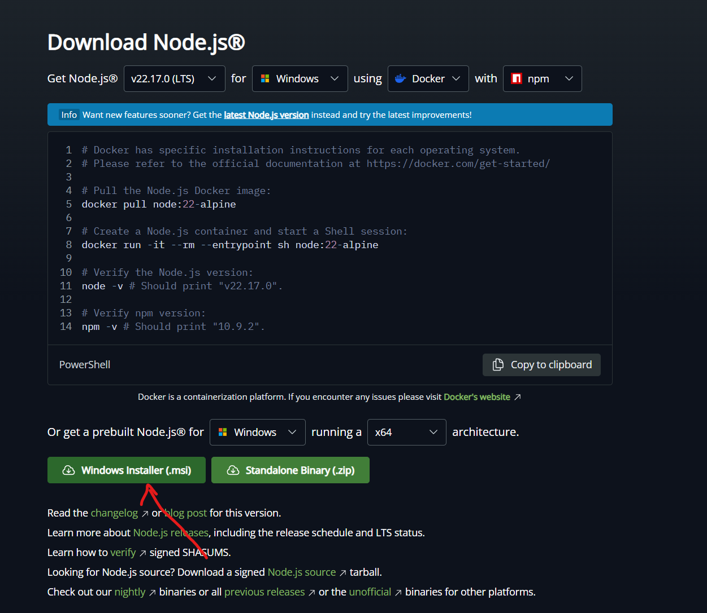
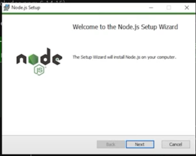
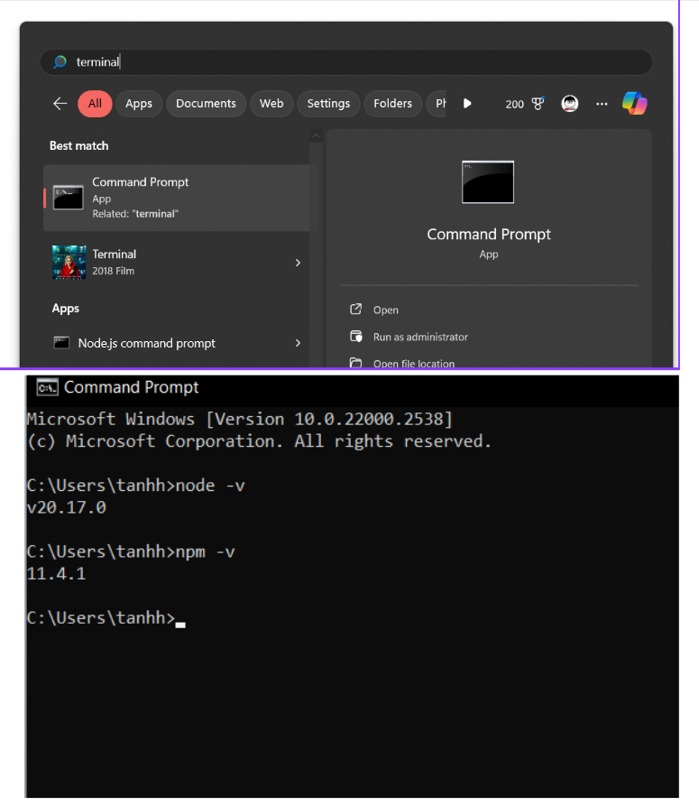
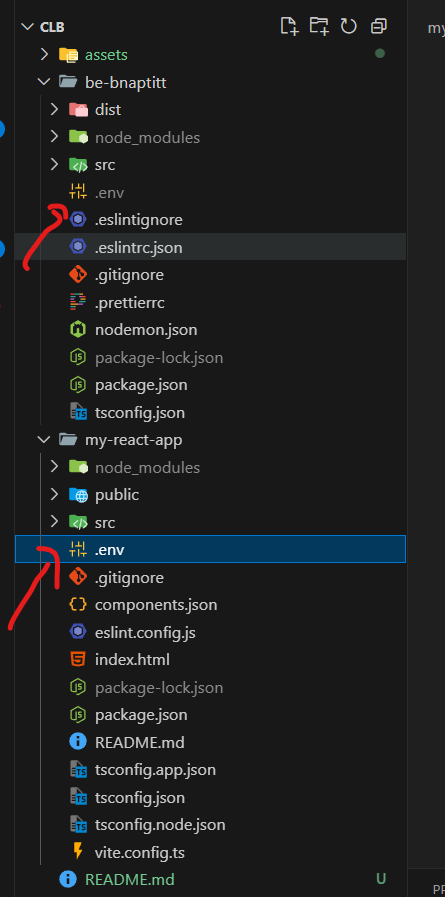
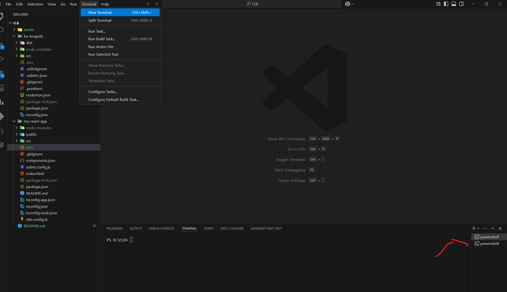
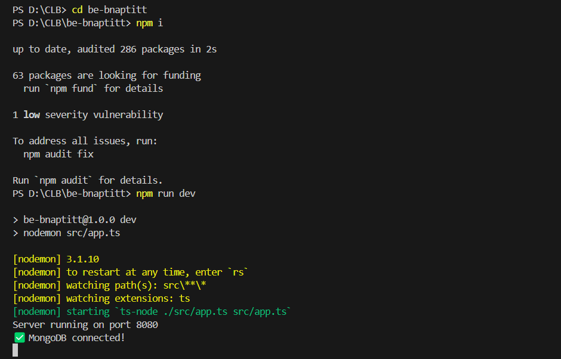
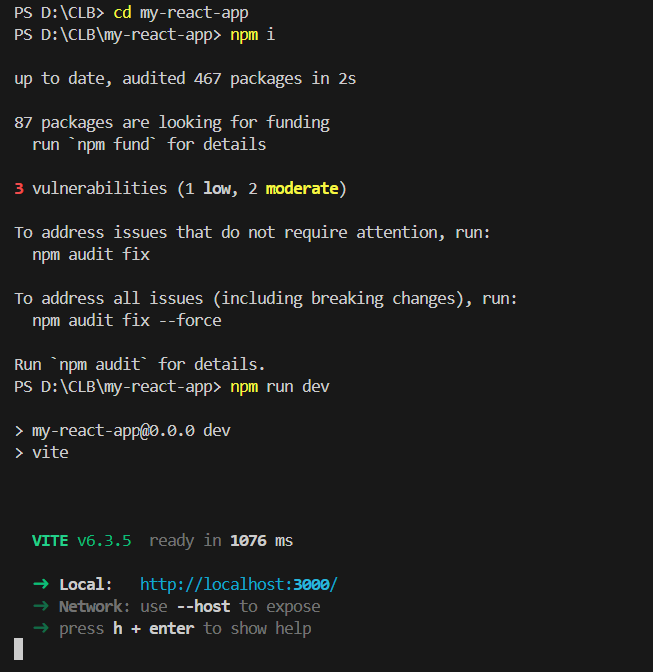

# Gửi mail tự dộng

Nếu các bạn cảm thấy mệt mỏi khi phải gửi mail liên tục, thì sản phẩm này dành cho bạn.

## Getting Started

Làm theo hướng dẫn để chạy được dự án.

### Cài đặt môi trường

---

Phải đảm bảo máy tính được cài đặt môi trường Nodejs. Vào đường dẫn https://nodejs.org/en/download

Bấm vào để tải về



Sau khi tải xong, click chuột thì hiển thị giao diện như sau. Sau đấy cứ bấm **Next** liên tục đến hết là được.



Sau khi bấm **Next** hết xong, vào terminal trên window rồi gõ từng câu lệnh một dưới đây rồi enter sao cho nó hiển thị như hình là được. Chú ý kết quả sau khi enter là phiên bản của phần mềm vừa cài, mỗi một thời điểm cài đặt thì phiên bản nó sẽ khác nhau. Như trong hình là phiên bản cũ, còn nếu cài phiên bản hiện tại thì sẽ là phiên bản mới. Nhưng không quan trọng, ra kết quả như hình là được.

```
node -v
npm -v
```



### Cài đặt dự án

---

Vào đường dẫn này https://github.com/TanhHolland/Mail_BNAPTIT. Sau đấy download file zip về, giải nén ra.


Sử dụng **Visual Studio Code** mở folder vừa giải nén thì có cấu trúc như sau. Ở mỗi folder **be-bnaptit** và **my-react-app** tạo một file **.env** hiển thị như hình ở dưới. Nội dung từng file thì yêu cầu liên hệ cho chủ quản để được hướng dẫn.



Tạo mới 2 terminal như hình



Ở terminal đầu tiên gõ những dòng lệnh sau rồi enter từng dòng lệnh một. Sau khi thực hiện thành công sẽ có kết quả ở dưới

```
cd be-bnaptitt
npm i
npm run dev
```



Ở terminal thứ 2 gõ những dòng lệnh sau rồi enter từng dòng lệnh một. Sau khi thực hiện thành công sẽ có kết quả ở dưới

```
cd my-react-app
npm i
npm run dev
```



## Chạy dự án

Gõ http://localhost:3000/ trên trình duyện để hiển thị kết quả

## Feedback

Nếu người đọc có đóng góp hay phản hồi hãy liên hệ email ở phần chủ quản.

## Contributors ✨

<table>
  <tbody>
    <tr>
      <td width="25%">
        <a href="https://github.com/TanhHolland">
          <br />
          <sub><b>Nguyễn Tuấn Anh</b></sub>
        </a><br />
      </td>
      <td width="25%">
        <a href="https://github.com/tranthingoc">
          <br />
          <sub><b>Nguyễn Quang Huy</b></sub>
        </a><br />
      </td>
      <td width="25%">
        <a href="https://github.com/linhthuynguyen612">
          <br />
          <sub><b>Nguyễn Thị Thùy Linh</b></sub>
        </a><br />
      </td>
    </tr>
  </tbody>
</table>

## Support

Nếu bạn thích dự và cảm thấy hữu ích, đừng ngần ngại tặng mình một cốc coffee!.

'

## 👨‍💻 Author

Tên: Tanh Holland

Email: n.tuananh0105@gmail.

GitHub: https://github.com/TanhHolland
